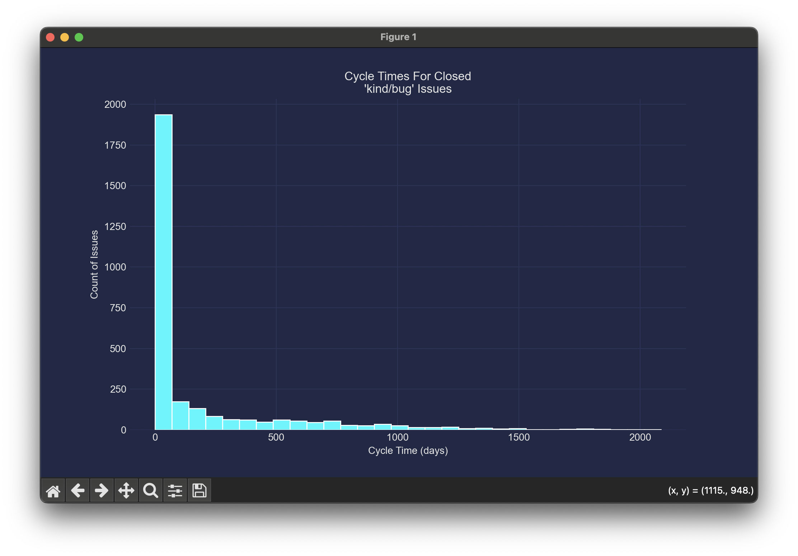
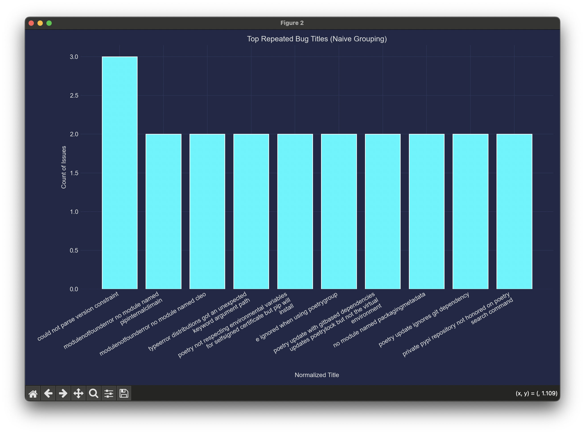
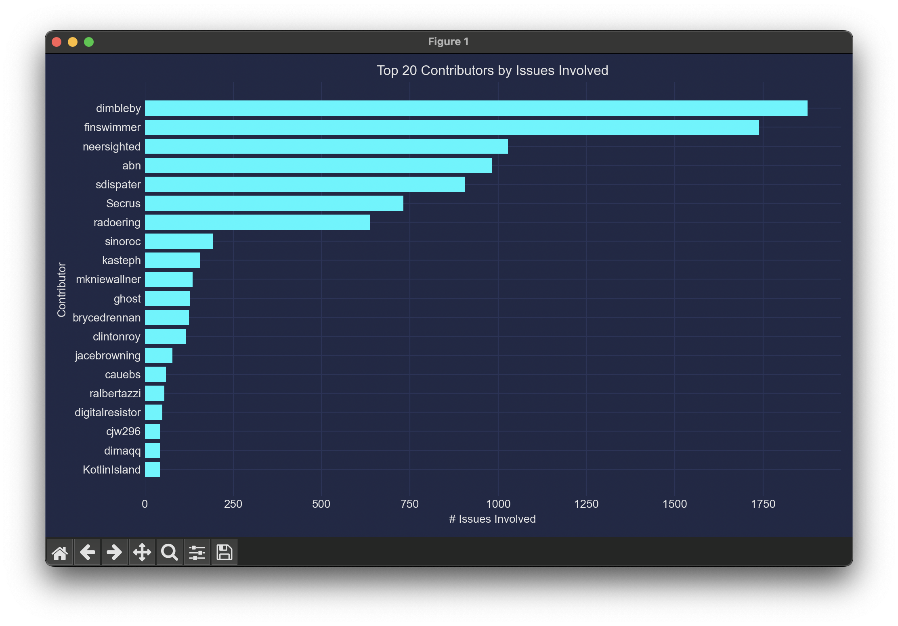
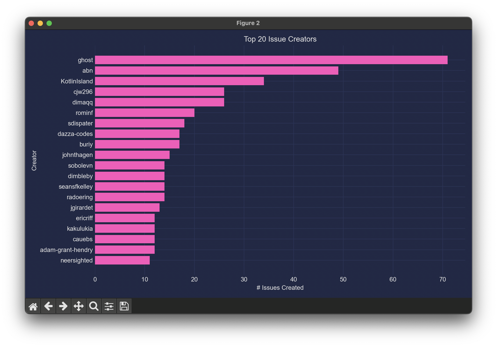
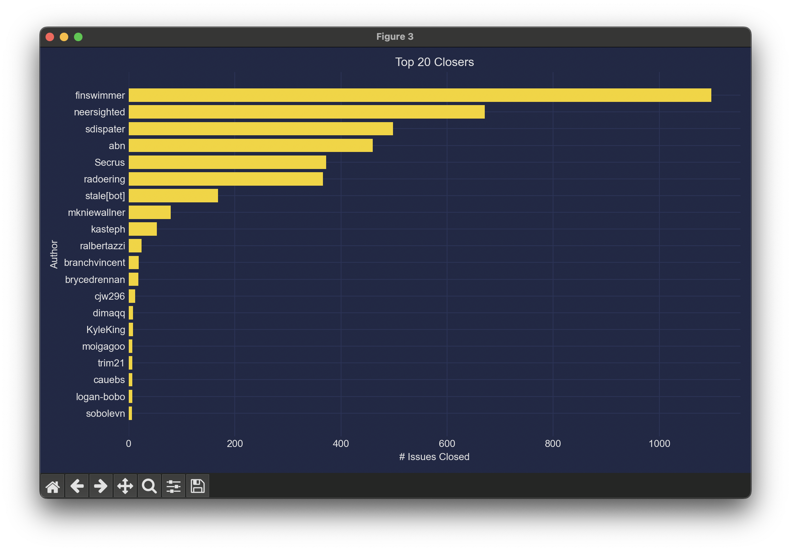
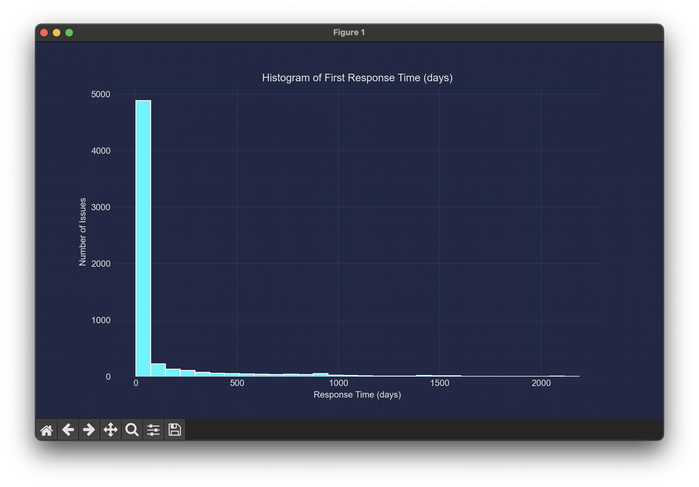
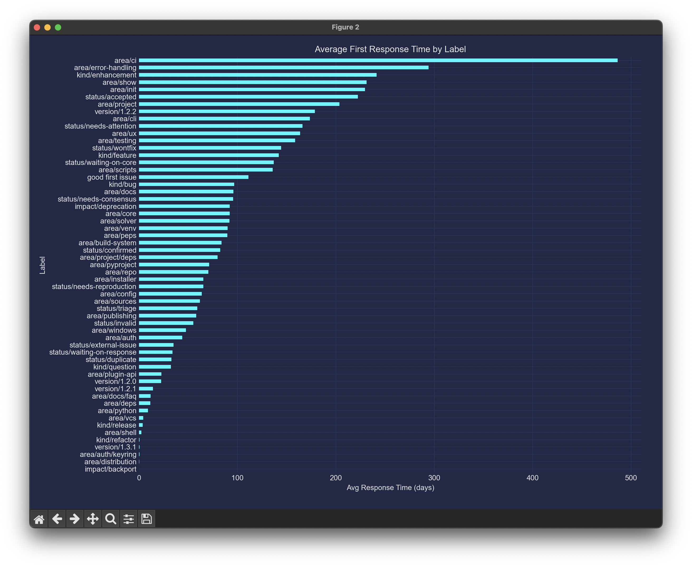
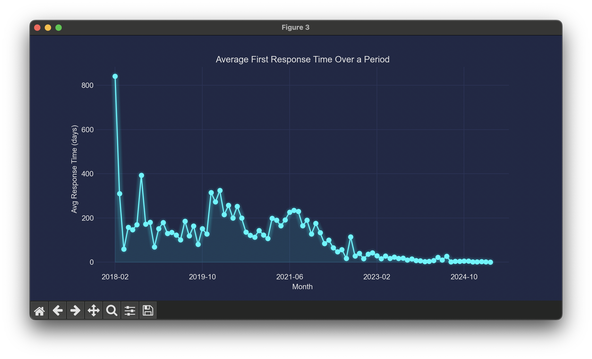

# ENPM611 Project Team 6

## ‼️ mplcyberpunk ‼️

Make sure you grab the latest version of mplcyberpunk.
Older versions will result in **IsADirectoryError: [Errno 21] Is a directory**

If the issue persists even after installing the latest version. In -

``` cmd
[path_to_your_virtual_pt_env]/lib/python3.9/site-packages/mplcyberpunk/__init__.py
```

Change :

```py
with importlib.resources.path("mplcyberpunk", "data") as data_path:
    cyberpunk_stylesheets = mpl.style.core.read_style_directory(data_path)
    mpl.style.core.update_nested_dict(mpl.style.library, cyberpunk_stylesheets)
```

To :

```py
from importlib.resources import files

data_path = files("mplcyberpunk").joinpath("data")
cyberpunk_stylesheets = mpl.style.core.read_style_directory(data_path)
mpl.style.core.update_nested_dict(mpl.style.library, cyberpunk_stylesheets)
```

## Planned Analysis

We have identified three core areas of GitHub issue analysis for the `python-poetry/poetry` repository:

1. **Cycle Time Analysis**  
   Calculate the cycle time of issues that are:
   - Labeled as `kind/bug`
   - Marked as `state: closed`
   - Including repeated/related bugs (identified via title similarity or labels)

2. **Resource Utilization**  
   Identify all contributors involved in each issue. This includes:
   - Issue creators
   - Assignees
   - Commenters and participants in the issue timeline (event actors)
   - Summarize total contributor involvement across all issues

3. **First Response Time Analysis**  
   Measure how quickly each issue received a response:
   - Compute the time from issue creation to the first external interaction (comment, mention, reference, or assignment)
   - Helps identify community responsiveness to incoming issues

---

## 📁 Milestone 1 Files

The following files have been created and submitted as part of Milestone 1:

### 🔢 Data

- `data/poetry.json` — Raw GitHub issue data with timeline events, labels, metadata
- `data/poetry_trimmed.json` — Cleaned version of the above containing only relevant event data

### 🧱 Diagrams

- `design/team_6class_diagram.svg` — Class diagram (UML format)
- `design/team_6class_diagram.txt` — Text version of the class diagram
- `design/team_6erd.svg` — Entity-Relationship (ER) Diagram (SVG format)
- `design/team_6erd.txt` — Text version of the ER diagram

---
This is the template for the ENPM611 class project. Use this template in conjunction with the provided data to implement an application that analyzes GitHub issues for the [poetry](https://github.com/python-poetry/poetry/issues) Open Source project and generates interesting insights.

This application template implements some of the basic functions:

- `data_loader.py`: Utility to load the issues from the provided data file and returns the issues in a runtime data structure (e.g., objects)
- `model.py`: Implements the data model into which the data file is loaded. The data can then be accessed by accessing the fields of objects.
- `config.py`: Supports configuring the application via the `config.json` file. You can add other configuration paramters to the `config.json` file.
- `run.py`: This is the module that will be invoked to run your application. Based on the `--feature` command line parameter, one of the three analyses you implemented will be run. You need to extend this module to call other analyses.

With the utility functions provided, you should focus on implementing creative analyses that generate intersting and insightful insights.

In addition to the utility functions, an example analysis has also been implemented in `example_analysis.py`. It illustrates how to use the provided utility functions and how to produce output.

## Setup

To get started, your team should create a fork of this repository. Then, every team member should clone your repository to their local computer. 

### Install dependencies

In the root directory of the application, create a virtual environment, activate that environment, and install the dependencies like so:

```bash
pip install -r requirements.txt
```

### Download and configure the data file

Download the data file (in `json` format) from the project assignment in Canvas and update the `config.json` with the path to the file. Note, you can also specify an environment variable by the same name as the config setting (`ENPM611_PROJECT_DATA_PATH`) to avoid committing your personal path to the repository.

### Run an analysis

With everything set up, you should be able to run the existing example analysis:

```bash
python run.py --feature 0
```

That will output basic information about the issues to the command line.

## VSCode run configuration

To make the application easier to debug, runtime configurations are provided to run each of the analyses you are implementing. When you click on the run button in the left-hand side toolbar, you can select to run one of the three analyses or run the file you are currently viewing. That makes debugging a little easier. This run configuration is specified in the `.vscode/launch.json` if you want to modify it.

The `.vscode/settings.json` also customizes the VSCode user interface sligthly to make navigation and debugging easier. But that is a matter of preference and can be turned off by removing the appropriate settings.

## What your commands produce

```bash
python run.py --feature 1
```




```bash
python run.py --feature 2
```





```bash
python run.py --feature 3
```



